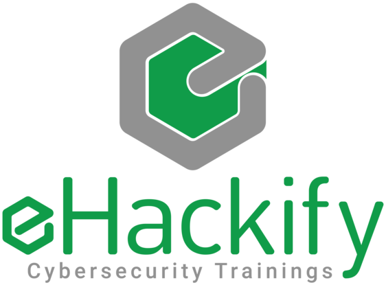

## 0l4bs

 
Cross-site scripting labs for web application security students

### List of Chall :
<pre>
~ Chall 1 | URL
~ Chall 2 | Form
~ Chall 3 | User-Agent
~ Chall 4 | Referrer
~ Chall 5 | Cookie
~ Chall 6 | LocalStorage
~ Chall 7 | Login Page
~ Chall 8 | File Upload
~ Chall 9 | Base64 Encoding
~ Chall 10 | Removes Alert
~ Chall 11 | Removes Script
~ Chall 12 | Preg_replace
~ Chall 13 | HTML Entities
~ Chall 14 | Regex Filter #1
~ Chall 15 | Regex Filter #2
~ Chall 16 | Regex Filter #3
~ Chall 17 | HTML Entities + URL Encode
~ Chall 18 | HTML Entities #2 (Special Character)
~ Chall 19 | HTML Entities #3 (Input Value)
~ Chall 20 | HTML Entities #4 (Input Value + Capitalizes)
</pre>

### Instalation :
<ul>
  <li>Run your web server (XAMPP / LAMPP)</li>
  <li>Clone the repository and put the files in the /htdocs/eh</li>
  <li>You can akses http://localhost:8080/eh</li>
  <li>Hacking Simplified ^_^</li>
</ul>

### Run this image

To run this image you need [docker](http://docker.com) installed. Just run the command:

    docker run --name web-ctf -d -it -p 80:80 ehackify/xssweblab
### Deploy Manually Docker image

- Clone this repo (`git clone https://github.com/ehackify`)
- Then run `docker build -t "eh-weblab" .` and wait untill it's done 
- If the build is clear, run this command `docker run --name web-ctf -d -it -p 80:80 eh-weblab`

 
 

Thnks for Abhi-M and Codepen for References

  
